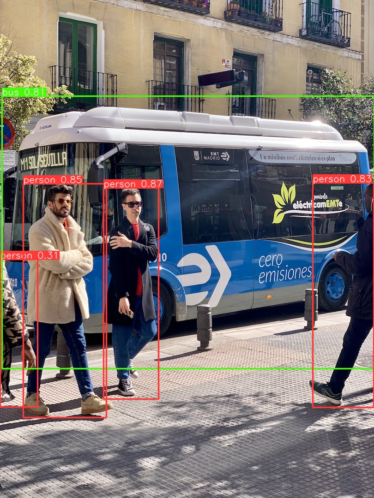

## YOLOv5 PyTorch
Use the pre-trained [YOLOv5](https://github.com/ultralytics/yolov5) directly for your object detection applications.

### Usage:
1. Download and extract YOLOv5 source code </br>
Please directly [download](https://github.com/ultralytics/yolov5/archive/refs/heads/master.zip) here.  </br>


2. Download pretrained weights </br>
You need to set ```yolov5_path``` correctly in ```download_weights.py``` file to avoid import error. </br>
```$ python download_weights.py```

3. Object detecion </br>
```$ python yolov5_detect.py --weights .\weights\yolov5s.pt --source .\images\bus.jpg```

4. Video object detection </br>
Use Yolov5 for object detection on your camera. </br>
```$ python camera_show.py```

### Sceenshots
